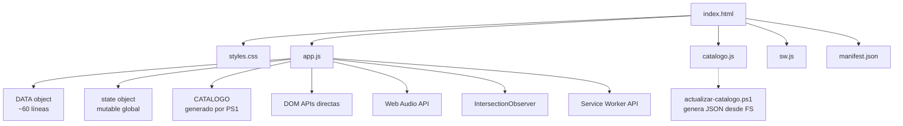

# Informe Técnico: Estado Actual y Plan de Madurez
**Lujos y Accesorios - Catálogo de Repuestos para Camiones**

---

## 1. Resumen Ejecutivo

| Métrica | Valor |
|---------|-------|
| **Tipo** | Aplicación Web Monopágina (SPA) Vanilla JS |
| **Líneas de código** | ~2,500 (HTML+CSS+JS) |
| **Archivos principales** | 6 (index.html, styles.css, app.js, catalogo.js, sw.js, manifest.json) |
| **Dependencias externas** | 0 (solo Google Fonts) |
| **Tests automatizados** | 0 |
| **Cobertura de código** | 0% |
| **Pipeline CI/CD** | No existe |
| **Versionado** | No existe (commits directos a main) |

**Veredicto**: **Prototipo funcional (TRL 4-5)** - Validado en entorno de desarrollo, no listo para producción comercial.

---

## 2. Arquitectura Actual



### Patrones identificados
- **Module Pattern** implícito (IIFE en `app.js` para estado)
- **Observer Pattern** (IntersectionObserver para scroll-reveal, contadores)
- **State Pattern** rudimentario (`state` object + render functions)
- **Factory Pattern** (`crearElementoRepuesto`)

### Violaciones a principios SOLID
| Principio | Violación |
|-----------|-----------|
| **S** (Single Responsibility) | `app.js`: routing, state, UI, audio, analytics, PWA, SW registration |
| **O** (Open/Closed) | Nuevos repuestos requieren modificar `DATA` o regenerar catálogo |
| **L** (Liskov) | No aplica (no hay herencia) |
| **I** (Interface Segregation) | No hay interfaces; todo acoplado a DOM global |
| **D** (Dependency Inversion) | Dependencias concretas (`document`, `navigator`, `AudioContext`) |

---

## 3. Deuda Técnica Priorizada

### 🔴 Crítica (Bloquea producción)
| ID | Ítem | Esfuerzo | Riesgo |
|----|------|----------|--------|
| DT-01 | **Sin testing** - Cualquier cambio rompe funcionalidad sin detectarse | 3d | Alto |
| DT-02 | **Estado global mutable** - Race conditions, debugging difícil | 2d | Alto |
| DT-03 | **Sin build/bundler** - No minificación, tree-shaking, code-splitting | 1d | Medio |
| DT-04 | **CSP ausente** - Vulnerable a XSS inline scripts/styles | 0.5d | Alto |

### 🟠 Alta (Calidad/mantenibilidad)
| ID | Ítem | Esfuerzo |
|----|------|----------|
| DT-05 | Separar capas: `state`, `services`, `ui`, `utils` | 3d |
| DT-06 | TypeScript + tipado estricto | 2d |
| DT-07 | Extraer catálogo a API/JSON estático + fetch | 1d |
| DT-08 | Web Components o framework ligero (Alpine/Petite-Vue/Lit) | 4d |
| DT-09 | i18n (español hardcodeado en JS/HTML) | 1d |

### 🟡 Media (Escalabilidad)
| ID | Ítem | Esfuerzo |
|----|------|----------|
| DT-10 | Backend real (Node/Go/Python) + DB para pedidos, stock, usuarios | 3w |
| DT-11 | Panel admin (CRUD repuestos, pedidos, analytics) | 2w |
| DT-12 | Tests E2E críticos (flujo cotización → WhatsApp) | 2d |
| DT-13 | Monitoring (Sentry, GA4 mejorado, Core Web Vitals) | 1d |

---

## 4. Plan de Madurez: De Prototipo a Producto

### Fase 0: Fundación (Semana 1-2) ⬅ **EMPEZAR AQUÍ**
```
✅ Git repo + GitHub
✅ package.json + scripts
✅ ESLint (airbnb-base) + Prettier + Husky
✅ Jest + @testing-library/dom (unit)
✅ GitHub Actions: lint + test en PR
✅ README: setup, scripts, arquitectura
✅ CHANGELOG + versionado semántico (v0.1.0)
✅ .env.example para configs
```

### Fase 1: Refactor Limpio (Semana 3-5)
```
✅ TypeScript migration (estricto)
✅ Arquitectura modular:
   /src
     /core          # state machine, event bus, DI container
     /services      # catalogo, cotizacion, analytics, audio
     /ui            # components (repuesto-card, toast, modal)
     /utils         # helpers puros (fecha, formato, validación)
     /styles        # CSS modular / PostCSS
✅ Web Components para UI reutilizable
✅ Vite como bundler (dev server, build, preview)
```

### Fase 2: Calidad Asegurada (Semana 6-7)
```
✅ Tests unitarios >80% cobertura (core/services)
✅ Tests integración (flujos estado)
✅ Playwright E2E: 5 happy paths críticos
✅ Accessibility audit (axe-core en CI)
✅ Performance budget (Lighthouse CI >90)
✅ Security headers (CSP, HSTS, Referrer-Policy)
```

### Fase 3: Producción Real (Semana 8-10)
```
✅ Staging environment (Vercel/Netlify/Cloudflare Pages)
✅ Deploy automático en merge a main
✅ Feature flags para rollout gradual
✅ Error tracking (Sentry)
✅ Analytics eventos negocio (GA4 + custom dashboard)
✅ Documentación API (OpenAPI si hay backend)
✅ Runbooks: deploy, rollback, incident response
```

### Fase 4: Escalabilidad (Mes 3+)
```
☐ Backend API (catálogo dinámico, pedidos, auth)
☐ Panel admin (CMS repuestos, gestión pedidos)
☐ Multi-tenant (varias sedes/marcas)
☐ PWA avanzada (background sync, push notifications)
☐ Internacionalización (ES/EN/PT)
```

---

## 5. Metodología Recomendada: **Scrum Ligero (2 semanas/sprint)**

### Roles (equipo pequeño = 1-2 devs)
| Rol | Responsable | Tiempo |
|-----|-------------|--------|
| Product Owner | Dueño del negocio (tú) | 20% |
| Developer | Quien codea | 80% |
| Scrum Master | Rotativo cada sprint | 5% |

### Artefactos Mínimos
| Artefacto | Herramienta | Frecuencia |
|-----------|-------------|------------|
| Product Backlog | GitHub Projects / Linear / Notion | Continuo |
| Sprint Backlog | GitHub Projects (columna Sprint) | Cada sprint |
| Definition of Done | `docs/DOD.md` | Revisar cada retro |
| Incremento | Deploy a staging | Cada sprint |

### Eventos (Timeboxed)
| Evento | Duración | Cuándo |
|--------|----------|--------|
| Sprint Planning | 1 hora | Inicio sprint |
| Daily Standup | 15 min | Diario (async OK) |
| Sprint Review | 30 min | Fin sprint (demo real) |
| Retrospective | 30 min | Fin sprint (Start/Stop/Continue) |

### Definition of Done (DoD) - **Obligatorio para cerrar ticket**
- [ ] Código pasa `npm run lint` sin warnings
- [ ] Tests unitarios nuevos/actualizados pasan (`npm test`)
- [ ] Build exitoso (`npm run build`)
- [ ] Deploy a staging verificado manualmente
- [ ] Documentación actualizada (README/CHANGELOG/ADR si aplica)
- [ ] Code review aprobado (auto-aprobado si solo 1 dev, pero **obligatorio PR**)

---

## 6. Stack Tecnológico Objetivo (Post-Refactor)

| Capa | Tecnología | Justificación |
|------|------------|---------------|
| **Build** | Vite | Rápido, ES modules native, plugins ecosistema |
| **Lenguaje** | TypeScript (strict) | Tipado, refactor seguro, DX |
| **UI** | Web Components (Lit) o Petite-Vue | Estándar, sin runtime pesado, SSR-ready |
| **Estado** | Señales (Signals) + Event Bus | Reactivo, predecible, testeable |
| **Estilos** | PostCSS + CSS Modules / Tailwind | Scoped, tree-shakable, design tokens |
| **Testing** | Vitest (unit) + Playwright (e2e) | Rápido, API compatible Jest |
| **CI/CD** | GitHub Actions | Gratis para público, integración nativa |
| **Hosting** | Cloudflare Pages / Vercel | Edge, gratis generoso, preview deploys |
| **Monitoring** | Sentry (errores) + GA4 (negocio) | Free tier suficiente inicio |

---

## 7. Estimación de Esfuerzo Total

| Fase | Semanas | Dev-days | Comentario |
|------|---------|----------|------------|
| 0: Fundación | 2 | 10 | Setup tooling, CI, testing baseline |
| 1: Refactor | 3 | 15 | TS, arquitectura modular, WC |
| 2: Calidad | 2 | 10 | Tests, a11y, perf, security |
| 3: Prod | 3 | 15 | Staging, deploy, monitoring, docs |
| **Total Mínimo** | **10** | **50** | ~2.5 meses a 1 dev tiempo parcial |

> **Nota**: Si contratas 1 dev full-time senior: **4-6 semanas**. Si lo haces tú part-time: **3-4 meses**.

---

## 8. Próximos Pasos Inmediatos (Esta semana)

```bash
# 1. Inicializar repo profesional
git init
git add .
git commit -m "chore: initial commit - prototype v0.1.0"

# 2. Crear package.json
npm init -y
npm i -D typescript vite vitest @testing-library/dom eslint prettier husky lint-staged
npm i -D @types/node

# 3. Configurar ESLint + Prettier + Husky
npx eslint --init
# ... seleccionar: Airbnb, TS, Browser, JSON

# 4. Scripts en package.json
"scripts": {
  "dev": "vite",
  "build": "tsc && vite build",
  "preview": "vite preview",
  "test": "vitest run",
  "test:ui": "vitest",
  "lint": "eslint src --ext .ts,.tsx",
  "format": "prettier --write src",
  "prepare": "husky install"
}

# 5. Primer PR con todo lo anterior → merge a main → tag v0.2.0
```

---

## 9. Documentos Complementarios a Crear

| Documento | Ubicación | Propósito |
|-----------|-----------|-----------|
| `ARCHITECTURE.md` | `/docs` | Diagramas C4, decisiones técnicas (ADRs) |
| `API_CATALOGO.md` | `/docs` | Contrato datos repuestos (JSON Schema) |
| `DEPLOYMENT.md` | `/docs` | Pasos deploy, rollback, variables entorno |
| `INCIDENT_RESPONSE.md` | `/docs` | Runbook caídas, contactos, escalamiento |
| `CONTRIBUTING.md` | `/` | Guía para colaboradores (branches, commits, PR) |
| `SECURITY.md` | `/` | Política vulnerabilidades, reporte responsable |

---

## 10. Conclusión

**El prototipo actual demuestra validación de mercado y usabilidad.** Tiene valor real: catálogo dinámico, UX pulida (animaciones, sonido, PWA), flujo WhatsApp funcional.

**Para ser software profesional** se requiere invertir ~50 dev-days en ingeniería: testing, arquitectura, automatización, observabilidad. No es reescribir desde cero; es **refactor incremental con red de seguridad (tests + CI)**.

El camino está claro. ¿Empezamos con Fase 0 esta semana?

---

*Documento generado: 2026-08-23*  
*Versión: 1.0*  
*Clasificación: Interno - Uso del equipo técnico*